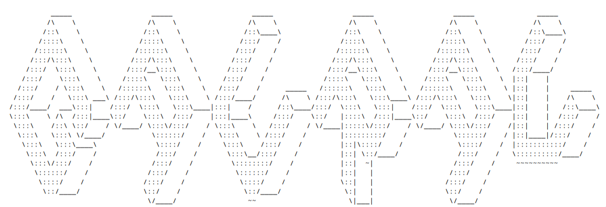

<p align="center">

</p>

<p align="center">
<video src="./assets/intro.mp4" autoplay muted loop playsinline width="100%"></video>
</p>


<br>
<br>

I'm **Gaurav**, an open-source builder shipping AI products, developer tools and blockchain infrastructure.
Currently obsessed with Solana.

[](https://github.com/gauravmandall.gpg) [](https://github.com/gauravmandall)


<br>


> I build software that solves real problems in **AI**, **Infrastructure**, **Developer Tools**, **Blockchain**, and **Open Source**.
>
> Over the last **6+ years** I've written **6M+ lines of code**, built **350+ repositories** (100+ public), and shipped everything from AI search engines to blockchain infrastructure.
>
> My previous GitHub account (**github.com/gauravmandall**) was suspended without any notification email. This profile is where the next chapter begins.

> I don't chase trends.
> I build tools I wish already existed.

---

## ⚡ Core Stack

```bash
AI           :: RAG · Agents · MCP · LLM
Frontend     :: React · Next.js · Tailwind
Backend      :: Rust · TypeScript · Node · Bun
Blockchain   :: Solana · Anchor · Ethereum
DevOps       :: Docker · Linux · CI/CD
```

---

### 🤖 AI & Agents

| Project | What it does | Stack | Links |
|---|---|---|---|
| **Cluelily** | AI-powered productivity workspace focused on organizing ideas, documents and workflows in one place. | Next.js · TypeScript · Tailwind · AI | [Live](https://cluelily.grvx.dev) · [Repo](https://github.com/gauravmandall/cluelily) |
| **Capsule** | AI health assistant that delivers personalized wellness insights, recommendations and conversations powered by modern LLMs. | Next.js · AI · TypeScript | [Live](https://capsule.gorlabs.com) |
| **Nimble Search** | AI-native search engine inspired by Perplexity with support for multiple LLM providers and web search. | Next.js · TypeScript · AI | [Live](https://nimble-search.vercel.app) |
| **CCTVAI** | AI surveillance system that detects people in real time, captures events and automates monitoring workflows. | TensorFlow.js · Next.js · TypeScript | [Live](https://cctvai.vercel.app) · [Repo](https://github.com/gauravmandall/cctvAi) |
| **Adaline** | Collection of AI experiments exploring modern language models, reasoning workflows and developer tooling. | Next.js · AI · TypeScript | [Live](https://adaline.grvx.dev) |

---

### ⛓️ Blockchain Infrastructure

| Project | What it does | Stack | Links |
|---|---|---|---|
| **Gorlabs** | Platform for building AI-powered infrastructure, blockchain tools and developer services across on-chain and off-chain ecosystems. | Rust · Go · Next.js · Docker | [Live](https://gorlabs.com) · [Repo](https://github.com/Gorlabscom/gorlabs) |
| **GeoHot** | Generates secure cryptocurrency wallets using BIP-39 mnemonics and multiple blockchain standards. | Web3.js · TypeScript · Crypto | [Live](https://geohot.gorlabs.com) · [Repo](https://github.com/gauravmandall/geohot) |
| **ERC20 Staking** | Smart contract staking platform allowing ERC-20 token holders to stake assets and earn on-chain rewards. | Solidity · Ethereum · React | [Repo](https://github.com/gauravmandall/erc20-staking) |
| **Vid Paywall** | Token-gated video platform where blockchain payments unlock premium content. | Next.js · Web3 · Solidity | [Repo](https://github.com/gauravmandall/vid-paywall) |

---

### 🌐 Web

| Project | What it does | Stack | Links |
|---|---|---|---|
| **GRVX** | Personal portfolio showcasing projects, writing and experiments with custom MDX components. | Next.js · MDX · Tailwind | [Live](https://grvx.dev) |
| **UI.GRVX** | Open-source UI component collection focused on modern interfaces and developer experience. | React · Tailwind | [Live](https://ui.grvx.dev) |
| **Malfoy** | Experimental web application exploring modern UI interactions and creative interfaces. | React · Next.js | [Live](https://malfoy.grvx.dev) |
| **Linkify** | Simple link management and sharing platform for organizing URLs. | Next.js · TypeScript | [Live](https://linkify.gorlabs.com) |
| **Summrize** | AI-powered text summarization tool for long-form articles and documents. | Next.js · AI | [Live](https://summrize.gorlabs.com) |

<br>

<br>


---

# 🏆 Journey

```text
2019 → First Commit
2020 → Open Source
2022 → AI
2024 → 350+ Repositories
2026 → GitHub Account Suspended
2026 → 0xgrvx
```
[](https://holopin.io/@gauravmandall)

<p align="center">

</p>


# 📊 Stats

<p align="center">


</p>

<p align="center">

</p>

<p align="center">

</p>

# 🌍 Connect

| Platform | Link |
|----------|------|
| 🌐 Website | [grvx.dev](https://grvx.dev) |
| 💻 GitHub | [0xgrvx](https://github.com/0xgrvx) |
| 📦 Previous GitHub | [gauravmandall](https://github.com/gauravmandall) *(Suspended)* |
| 🐦 X | [@gauravmandall](https://x.com/gauravmandall) |
| 💼 LinkedIn | [gauravmandall](https://linkedin.com/in/gauravmandall) |
| ✉️ Email | [hi@grvx.dev](mailto:hi@grvx.dev) |
| 💬 Telegram | [@gauravmandall](https://t.me/gauravmandall) |
| 📚 Dev.to | [gauravmandall](https://dev.to/gauravmandall) |

<p align="center">

</p>

### Software eventually disappears.
<p align="center">
  
</p>
